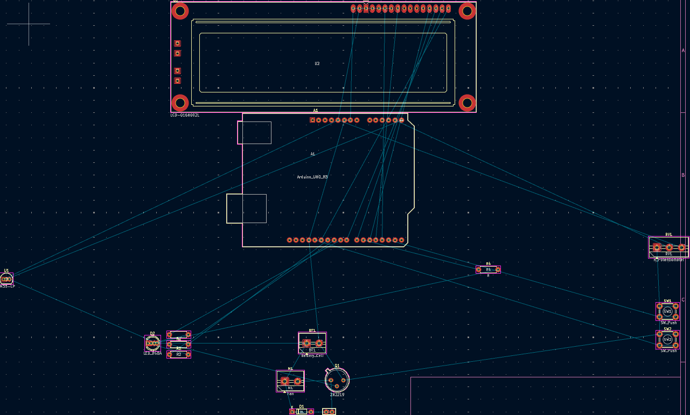
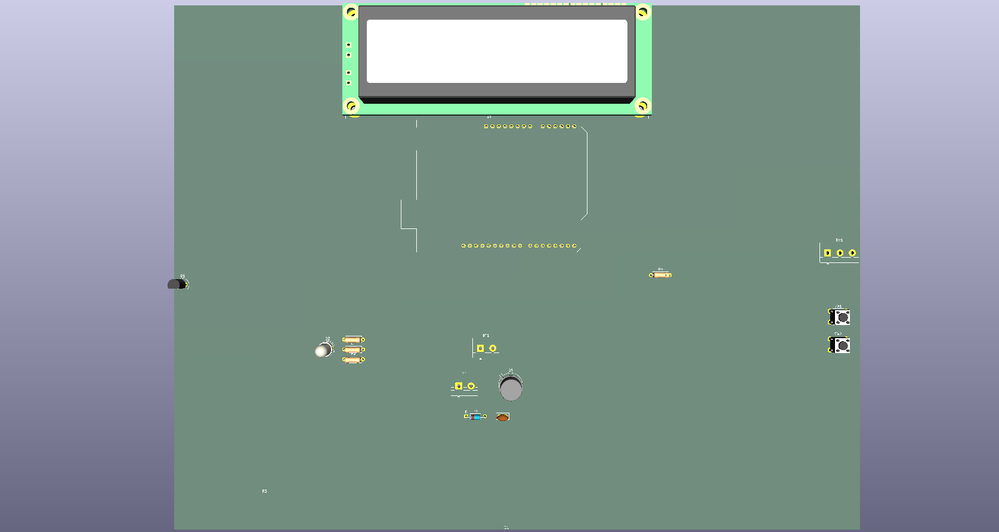

# Arduino Temperature-Controlled Fan PCB

My first manufactured PCB: an Arduino Uno expansion board for a temperature-controlled DC fan with automatic and manual operating modes.

This project developed an earlier breadboard prototype into my first manufactured PCB. It brought together embedded programming, analogue sensing, PWM motor control, user inputs, LCD output, schematic capture, PCB layout, soldering, testing and hardware debugging.

Arduino Uno, Embedded C/C++, KiCad, PCB Design, PWM ADC, and Hardware Debugging

Status — Version 1 tested: The PCB was successfully designed, manufactured and assembled. The controls and several interfaces worked, while bring-up exposed three hardware issues to correct in Version 2: the fan-driver routing, RGB LED pin mapping and LM35 interface

[Powered assembled PCB](docs/images/hardware/pcb-powered-on.jpg)

[Watch the Version 1 prototype demonstration] (https://github.com/marknkan/arduino-temperature-controlled-fan-pcb/releases/tag/v1.0)

# Contents

- Project objectives

- Operating modes

- Hardware

- Main pin assignments

- PCB development

### Schematic

### PCB layout

### 3D render

- Firmware development

- Testing and results

- Detailed engineering test log

# What I learned

- Version 2 improvements

- Repository structure

- Project objectives

- Convert a working breadboard fan controller into a custom PCB.

- Read temperature using an LM35 analogue temperature sensor.

- Control a DC fan automatically according to temperature.

- Provide manual fan-speed control using a potentiometer.

- Display the selected mode, temperature and fan output on a 16×2 LCD.

- Use of an RGB LED to indicate operating mode and temperature range.

- Use of push buttons to change mode and return to the startup screen.

- Complete the full PCB lifecycle from schematic capture to assembly and testing.

# Operating modes

- Automatic mode

The Arduino reads the LM35 sensor and changes the requested fan speed and RGB status according to temperature:

| Temperature | Fan command | RGB indicator |
| :--- | :--- | :--- |
| Below 20 °C | Low | Blue |
| 20–28 °C | Medium | Orange/amber |
| Above 28 °C | Full | Red |

# Manual mode

The potentiometer is read through an analogue input and mapped to a PWM value from 0–255. This value controls the requested fan speed, the green LED brightness and the fan percentage shown on the LCD.

- Hardware

- Arduino Uno R3

- Custom two-layer PCB

- LM35 temperature sensor

- 16×2 HD44780-compatible LCD

- Common-cathode RGB LED and current-limiting resistors

- DC fan

- NPN transistor motor-driver stage

- Flyback diode

- Motor suppression capacitor

- Potentiometer

- Two push buttons

- External battery supply

- Screw terminals and Arduino stacking headers

# Main pin assignments

| Function | Arduino pin |
| :--- | :--- |
| Mode button | D2 |
| LCD RS | D3 |
| LCD Enable | D4 |
| LCD D4 | D5 |
| RGB blue | D6 |
| LCD D5 | D7 |
| LCD D6 | D8 |
| RGB red/green channels | D9 and D10 |
| Fan PWM command | D11 |
| LCD D7 | D12 |
| Reset/startup button | D13 |
| LM35 output | A0 |
| Potentiometer | A4 |

# Revision note:
Early firmware used A5 for the LM35 before PCB testing moved it to A0. The red and green RGB assignments were also swapped between D9 and D10 during diagnosis. These changes are retained in the test history below.

# PCB development
1. PCB development

2. The board was designed in KiCad. The workflow included:

3. Schematic capture and net labelling

4. Electrical Rules Check (ERC)

5. Through-hole footprint selection

6. Component placement and board-outline creation

7. Track routing and ground-zone fills

8. Design Rules Check (DRC)

9. Gerber and drill-file generation

10. PCB manufacture

11. Through-hole assembly and soldering

12. Continuity, voltage and functional testing

The manufactured board had a clean finish, readable silkscreen and correctly aligned Arduino headers.

# Firmware development

The firmware was changed throughout bring-up so individual subsystems could be isolated and tested.

| Stage | Code change | Reason and result |
| :--- | :--- | :--- |
| Initial controller | Added automatic and manual modes, Serial selection at 9600 baud, LM35 conversion and PWM fan control | Established the working breadboard behaviour before PCB integration. |
| LCD integration | Added LiquidCrystal lcd(3, 4, 5, 7, 8, 12) and lcd.begin(16, 2) | Displayed startup, selected mode, temperature and manual speed percentage. |
| Input handling | Configured buttons D2 and D13 with active-LOW logic and a 300 ms debounce/reset delay | Enabled mode switching and return to the startup screen. |
| Manual control | Mapped potentiometer 0–1023 to PWM 0–255, then to 0–100% for the LCD | Potentiometer readings changed correctly and the manual control logic worked. |
| Automatic control | Set fan commands to 80, 180 and 255 at <20 °C, 20–28 °C and >28 °C | Preserved the three temperature bands from the breadboard system. |
| Sensor debugging | Changed the LM35 input from A5 to A0 and printed raw ADC, calculated voltage and temperature | Exposed abnormal sensor values instead of hiding them behind the temperature calculation. |
| RGB debugging | Swapped red/green assignments between D10/D9 and D9/D10; ran individual colour tests | Red and green responded, but blue remained open because of the hardware pin-order mismatch. |
| Timing adjustments | Tried 1000 ms and 1200 ms automatic delays; retained a 250 ms manual delay | Made Serial and LCD behaviour easier to observe during testing. |
| Safe reset | Set fan PWM to 0 and requested RGB white 255,255,255 before returning to startup | Fan-off logic worked in code; true white was prevented by the failed blue LED channel. |

The final repository should retain the complete Arduino source in firmware/ so the implementation can be compared with this change history.

# Testing and Results 

| Area | Result | Notes |
| :--- | :--- | :--- |
| PCB manufacture | Pass | Board quality, outline, silkscreen and header alignment were good. |
| Arduino connection | Pass | The PCB fitted and connected to the Arduino Uno through its headers. |
| Power and continuity | Pass | Key power and signal connections were checked before full testing. |
| Push buttons | Pass | Mode selection and startup/reset input were detected. |
| Potentiometer input | Pass | The analogue value changed correctly. |
| LCD interface | Partial | The display powered up, but contrast and signal problems prevented reliable text. |
| LM35 circuit | Partial | The circuit produced inconsistent analogue readings during orientation and soldering tests. |
| RGB LED | Partial | Red and green worked; a footprint-to-component mismatch prevented blue. |
| Fan-driver stage | Fail — V1 | The transistor emitter and collector were routed incorrectly for the intended low-side switch. |

# Debugging performed

- Used continuity mode to trace PCB nets and verify solder joints.

- Measured supply and analogue voltages with a multimeter.

- Checked the Arduino headers and LCD signal paths.

- Investigated LCD power, contrast and data connections.

- Removed, reoriented and resoldered the LM35 during sensor testing.

- Tested individual RGB LED channels and identified a footprint/pinout mismatch.

- Reviewed the transistor circuit and found the emitter/collector routing error.

- Reflowed joints and used solder wick and a solder sucker where required.

# Detailed engineering test log

This section preserves the numerical readings and different troubleshooting approaches used during Version 1 bring-up. Conflicting results are intentionally included because they were recorded at different stages of debugging.

<strong>View detailed test measurements and troubleshooting log</strong>

# Test equipment and reference values

| Item | Value or setting | Purpose |
| :--- | :--- | :--- |
| Multimeter | Continuity/resistance mode | Checking tracks, headers, solder joints and component paths |
| Multimeter | 20 V DC range | Measuring the Arduino, LCD, LM35 and PCB supply voltages |
| Arduino ADC | 10-bit, 0–1023 | Reading the LM35 and potentiometer |
| ADC reference used in firmware | 5.0 V | Converting ADC counts to voltage |
| LM35 scale factor | 10 mV/°C | Converting sensor output voltage to temperature |
| Expected LM35 room-temperature output | Approximately 0.18–0.30 V | Reference range used during diagnosis |
| Serial Monitor | 9600 baud | Viewing raw ADC, voltage, temperature and potentiometer data |
| LCD | 16 columns × 2 rows | User display |

The conversion used in the firmware was:

voltage = rawADC × (5.0 / 1023.0)
temperatureC = voltage × 100.0

An earlier temperature-monitor version expressed the same conversion as:

voltage = (5.0 / 1023.0) × rawADC
millivolts = voltage × 1000
temperatureC = millivolts / 10

# Firmware values tested

| Parameter | Value |
| :--- | :--- |
| Full fan PWM | 255 |
| Medium fan PWM | 180 |
| Low fan PWM | 80 |
| Fan off PWM | 0 |
| Full LED brightness | 255 |
| Potentiometer ADC input range | 0–1023 |
| Mapped manual PWM range | 0–255 |
| Mapped LCD speed range | 0–100% |
| Cold threshold | <20 °C |
| Medium-temperature range | 20–28 °C |
| Hot threshold | >28 °C |
| Amber RGB command | Red 255, Green 40, Blue 0 |
| Reset/startup RGB command | Red 255, Green 255, Blue 255 |
| Automatic-loop delays tried | 1000 ms and 1200 ms |
| Manual-loop delay | 250 ms |
| Button debounce/reset delay | 300 ms |

# LCD tests

| Test or observation | Result |
| :--- | :--- |
| LCD interface tested with LiquidCrystal lcd(3, 4, 5, 7, 8, 12) | This was the final PCB-oriented firmware mapping: RS=D3, E=D4, D4=D5, D5=D7, D6=D8, D7=D12. |
| LCD supply/header continuity | Recorded readings across tested LCD signal paths were approximately 0–0.8 Ω, supporting continuity through the PCB connections. |
| LCD power-up | The backlight powered and white character blocks appeared, showing that the module had power but was not displaying valid text. |
| Firmware/serial activity | The display later flickered in time with Serial activity. It also became dim and flashed during later attempts. |
| Contrast pin approach | LCD pin 3 (VO) was investigated because no dedicated contrast potentiometer was fitted to the PCB. |
| Temporary contrast tests proposed | VO directly to GND or through approximately 1 kΩ; these were diagnostic approaches and were not preserved as confirmed final measurements. |
| LCD power reference used for diagnosis | Pin 1=GND, pin 2=5 V, pin 5 (RW)=GND, pin 15=5 V, pin 16=GND. |
| Startup text in firmware | Line 1: Auto or Manual?; line 2: Pick :). |
| Mode screens in firmware | (Automatic Mode) with Degrees (C):; (Manual Mode) with Speed: <0–100>%. |

# LM35 temperature-sensor tests

| Test stage | Recorded result | Interpretation/action |
| :--- | :--- | :--- |
| Original PCB definition | LM35-LP U1, TO-92_Inline; Pad 1=+5 V, Pad 2=VOUT, Pad 3=GND | The footprint’s flat-face edge was shown at the bottom, creating an orientation check against the real part. |
| Firmware revisions | Early versions used A5; later PCB testing used A0 | This A5/A0 mismatch was tracked as a firmware/documentation conflict. |
| First abnormal result | Approximately 70 °C | Far above room temperature, so the sensor orientation, pin mapping, soldering and ADC input were investigated. |
| Later abnormal result | Approximately 200 °C | Confirmed that the analogue signal was still invalid rather than representing room temperature. |
| Serial debug result | Raw ADC=471 | Used to calculate the corresponding input voltage. |
| Calculated ADC voltage | 471 × (5/1023) = 2.302 V | Much higher than the expected LM35 room-temperature output. |
| Calculated temperature | 2.302 V × 100 = 230.2 °C | Demonstrated that the code conversion was consistent with the voltage, but the input signal was incorrect. |
| Later A0 measurement | Approximately 0.03 V | Too low for the expected room-temperature LM35 output. |
| LM35 middle/output pin measurement | Approximately 1.25 V | Equivalent to roughly 125 °C using the LM35 scale; still invalid for room temperature. |
| Nearby header/supply-gap measurement | Approximately 4.67 V | Confirmed that a near-5 V supply was present at the tested header location. |
| Expected room-temperature reference | Approximately 0.18–0.30 V | Equivalent to roughly 18–30 °C. None of the abnormal readings consistently matched this range. |
| Sensor installed | Arduino sometimes appeared as COM9 | The sensor’s presence coincided with a changed/unstable port during one stage of testing. |
| Sensor removed | Arduino appeared as COM11 | Removing the LM35 restored the expected connection during that attempt. |
| After removal/resoldering | COM11 operation later returned | The COM-port issue was eventually cleared, but the sensor output remained unreliable. |
| Orientation attempt | LM35 was removed, flipped/reoriented and soldered again | The same general fault remained, reducing confidence that orientation alone was the cause. |
| Replacement approach | A bare LM35 was tried | This ruled out relying only on the original sensor/component form. |
| Hole-clearing issue | Desoldered holes filled with solder | Wick/sucker and reheating were used until the sensor could be inserted again. |
| Unsoldered insertion test | LM35 could be inserted after the holes were cleared | Used as another contact/orientation test before final soldering. |

The usual LM35 TO-92 reference used during diagnosis, with the flat face toward the viewer, was:

Left: +5 V    Middle: VOUT    Right: GND

This was checked against the exact part and PCB footprint rather than assumed to be universally correct.

# RGB LED tests

| Test or observation | Result |
| :--- | :--- |
| Physical LED type | 5 mm diffused common-cathode RGB LED |
| Physical orientation observed | Flat side facing right; longest lead expected to be the common cathode/GND. |
| PCB pad order | Pad 1=Red, Pad 2=Green, Pad 3=Blue, Pad 4=GND |
| Suspected physical LED order | Red, Green, GND, Blue |
| Red-channel continuity/function | Continuity/function was obtained. |
| Green-channel continuity/function | Continuity/function was obtained. |
| Blue-channel continuity test | OL / open circuit was observed. |
| Visual functional result | Red and green worked; blue did not. White, which requires all three channels, therefore could not display correctly. |
| Earlier firmware mapping | Red=D10, Green=D9, Blue=D6 |
| Later test mapping | Red=D9, Green=D10, Blue=D6 |
| Manual-mode target | Green brightness follows the potentiometer PWM value from 0–255. |
| Automatic-mode target | Blue below 20 °C; amber from 20–28 °C; red above 28 °C. |
| Mechanical inspection | Bent/soldered LED leads were checked because adjacent pins might have touched. |
| Diagnostic approaches | Individual-channel sketches, red/green pin swapping, reflowing solder joints and continuity tests through the resistors/tracks were used. |

# Potentiometer and button tests

| Test | Result |
| :--- | :--- |
| Potentiometer input | Connected to A4; ADC range 0–1023 was mapped to PWM 0–255. |
| LCD manual output | PWM 0–255 was mapped again to 0–100%. |
| Potentiometer hardware | The physical potentiometer did not match the selected footprint cleanly and was trimmed/adjusted to fit. |
| Potentiometer response | Analogue values changed, confirming that the control input worked. |
| Mode button | D2, configured with INPUT_PULLUP; active state=LOW. |
| Second/reset button | D13, active state=LOW. |
| Mode action | Toggled the manualMode Boolean after a 300 ms debounce delay in one firmware version. |
| Reset action | Set fan PWM to 0, commanded RGB 255,255,255, waited 300 ms, and returned to the startup selection. |
| Functional result | Both mode/reset button functions were detected during testing. |

# Motor, transistor and power tests

| Test or design review | Result |
| :--- | :--- |
| Motor PWM pin | Arduino D11 |
| Intended driver | 2N2222 NPN low-side switch |
| Intended power path | Battery positive → fan positive; fan negative → transistor collector; transistor emitter → GND/battery negative |
| Intended control path | Arduino D11 → base resistor → transistor base |
| Grounding requirement | Arduino GND and external battery negative must share a common ground. |
| Supplies considered/tried | Initially a 9 V battery; later a switched 4×AA battery holder with rechargeable cells. |
| Fan command values | Off=0, low=80, medium=180, full=255 |
| Terminal inspection | Fan/battery wires were found loose in the screw terminals during bring-up and required reseating/tug checking. |
| Driver design review | The PCB emitter/collector routing did not implement the intended low-side switch correctly. |
| Functional result | The V1 fan-driver stage did not operate successfully from the assembled PCB. |
| Conclusion | Because the copper routing was wrong, repeated firmware changes could not correct the hardware fault. |

# Arduino and PCB interconnection tests

| Test | Result |
| :--- | :--- |
| Arduino stacking headers | Soldered and the PCB was fitted directly onto the Arduino Uno. |
| Header alignment | Mechanically aligned with the Uno and the manufactured board fitted successfully. |
| Power-up | Board and LCD received power without an immediate destructive failure. |
| Continuity testing | Used across LCD nets, RGB resistors/tracks, ground paths and header connections. |
| Solder repair methods | Joint reflow, added flux, solder wick, solder sucker and hole clearing. |
| KiCad checks before manufacture | ERC and DRC completed; the PCB update reported 0 warnings and 0 errors. |
| Key lesson | 0 ERC/DRC errors confirmed rule compliance, but did not detect incorrect real-component pin mapping or the transistor circuit-design error. |

# Approaches discussed but not recorded as completed measurements

The following were valid troubleshooting proposals, but no final numerical result was preserved. They are separated to avoid presenting suggestions as measured evidence:

- Testing LCD VO directly at GND and through approximately 1 kΩ.

- Confirming every LCD supply pin with an exact 5.00 V measurement.

- Testing the fan independently by connecting it directly to the external battery.

- Measuring transistor base, collector and emitter voltages while commanding PWM 0 and 255.

- Testing each RGB colour with a standalone current-limited supply.

- Rebuilding the LM35 circuit fully on a breadboard and comparing its output with the PCB.

- Substituting another known-good LM35 and repeating the same voltage measurements.

# What I learned

- How to move from a breadboard prototype to a manufactured PCB.

- How schematic symbols, footprints and real component pinouts must be verified against datasheets.

- How to use ERC and DRC without treating a clean result as proof that the circuit itself is correct.

- How an NPN transistor should be connected as a low-side motor switch.

- Why component orientation, test points and accessible connectors matter during bring-up.

- How to perform staged power-up, continuity and voltage testing.

- How hardware faults can appear to be software faults, and vice versa.

- How to document failed tests and turn them into specific design changes.

# Version 2 improvements

- Correct the transistor emitter/collector routing.

- Verify every symbol-to-footprint pin mapping against the component datasheet.

- Use an RGB LED footprint that matches the exact physical pin order.

- Add a socket or removable header for the LM35.

- Improve LCD contrast control and connector labelling.

- Add clearly labelled test points for power, ground, sensor output and PWM.

- Improve component spacing and keep parts farther from the board edge.

- Review motor-current requirements and select the driver stage accordingly.

- Repeat schematic peer review, ERC, DRC and bench validation before manufacture.
├── firmware/          # Arduino source code
├── hardware/
│   ├── kicad/         # KiCad schematic and PCB files
│   ├── gerbers/       # PCB manufacturing files
│   └── bom/           # Bill of materials
├── docs/
│   ├── images/        # Project and testing photographs
│   └── testing/       # Measurements and test notes
├── LICENSE
└── README.md

# Author
# Mark Nkan
- Electrical and Electronic Engineering student interested in embedded systems, PCB design, control systems and hardware development.
